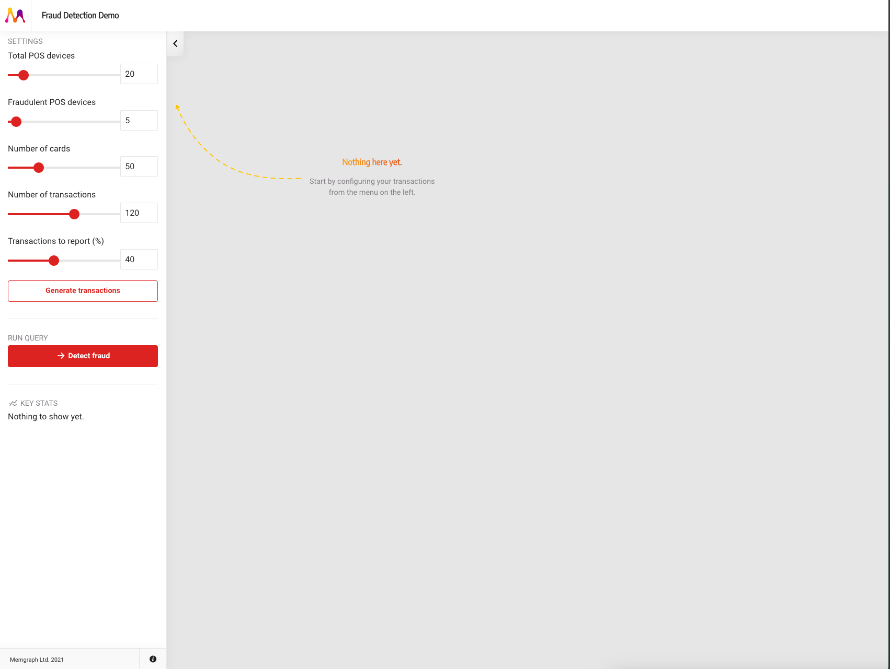

# 🚀 memgraph/card-fraud

## Run Locally
```shell
git clone https://github.com/memgraph/card-fraud.git
cd card-fraud
docker-compose up
```

## For LLM to understand the code
```shell
gitingest https://github.com/memgraph/card-fraud.git -i "*.py"
```

## Meaning
- **Total POS devices** : Represents nodes in the graph. These devices might be compromised (hacked)
- **Number of cards** : Represents nodes in the graph. These are the cards used by users to make transactions, which might also be compromised
- **Number of transactions** : Represents relationships in the graph. These are the connections between POS devices and cards, which might be marked as fraudulent

## Result
This repository does not use any machine learning model to detect fraud. Instead, it employs a simple random probability-based approach to simulate fraud detection. Refer to the code in the `card-fraud.py` `pump_transactions` function.

```python
# card-fraud.py

def pump_transactions(...):
    """Create transactions. If the POS device is compromised,
    then the card in the transaction gets compromised too.
    If the card is compromised, there is a 0.1% chance the
    transaction is fraudulent and detected (regardless of
    the POS device)."""
```



## How to improve
1. Explore whether a mathematical model exists to better simulate the probability of fraud occurring, rather than relying solely on random probabilities
1. Implement a machine learning model to detect fraud